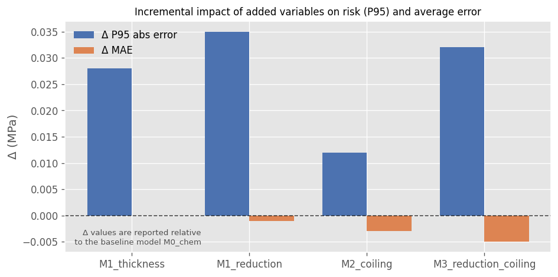
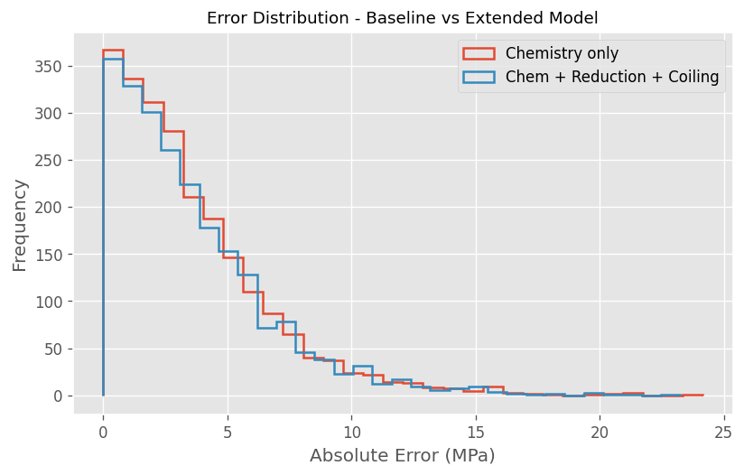

# SC04 — Variable Influence Screening in Chemistry-Based UTS Models

> **Adding process variables to a conservative predictive model does not automatically improve its robustness or decision value. This study evaluates whether commonly measured, metallurgically motivated process variables provide meaningful incremental signal beyond a chemistry-only baseline.**

---

## 1. Why This Study Case Exists

In industrial environments, many process variables are measured continuously because they are **operationally important and metallurgically justified**.

These variables typically:
- Have internal guidelines or target ranges
- Are monitored to ensure process stability
- Are controlled for reasons that go beyond prediction

However, a common modeling failure mode occurs when:
- Variables are added to predictive models simply because they are available
- Model complexity increases without verifying incremental signal
- Apparent improvements in fit do not translate into improved robustness

This study case exists to answer a **modeling-specific question**, not a process-design one:

> **Do commonly measured, metallurgically relevant process variables provide stable and meaningful incremental predictive value when combined with a chemistry-only UTS model?**

This study does not evaluate whether these variables should be measured or controlled in production. It evaluates only whether they provide incremental predictive signal when combined with a chemistry-only model for UTS.

---

## 2. Problem Framing and Hypothesis

### Strategic Modeling Problem

Measuring a variable and **using it in a model** are fundamentally different decisions.

While many variables must be monitored and controlled in production, not all of them necessarily:
- Add independent information to a given predictive task
- Improve model robustness
- Justify increased model complexity

For internal standards supported by predictive models, unnecessary complexity can:
- Reduce interpretability
- Complicate deployment
- Create a false sense of control

The central modeling question addressed here is therefore:

> **Which commonly measured process variables provide incremental predictive signal beyond chemistry when modeling UTS?**

### Hypothesis

> *Only variables that consistently reduce tail error and remain stable across validation folds provide meaningful incremental value in a chemistry-based UTS model.*

Demonstrating **limited or no improvement** is considered a valid and informative outcome.

---

## 3. Screening Philosophy and Design Principles

This study follows a deliberately **conservative and disciplined modeling philosophy**.

### 3.1 Frozen Baseline Principle  
The chemistry-only model:
- Is defined once
- Remains unchanged throughout the study
- Serves as the fixed reference point

All observed differences must be attributable solely to the added variables.

### 3.2 Metallurgically Motivated Variable Selection  
The evaluated variables were not selected opportunistically.

They were chosen because:
- They are routinely measured in the process
- They follow internal guidelines or typical operating ranges
- They are metallurgically linked to process outcomes

This ensures the screening exercise reflects **real industrial modeling decisions**.

### 3.3 Risk Reduction Over Metric Optimization  
Average error improvements alone are insufficient.

Variables must demonstrate:
- Reduction in **P95 absolute error**
- Stability across validation folds
- Consistent behavior under conservative evaluation

---

## 4. Methodological Decisions (What We Chose — and Why)

- **System:** AA3105-O
- **Baseline features:** Mn, Mg
- **Candidate process variables:**
  - Final thickness
  - Reduction percentage
  - Coiling temperature  
- **Target:** UTS (MPa)
- **Validation:** Group-aware cross-validation by heat
- **Model:** Ridge regression (fixed architecture)

Alternative representations of deformation (final thickness vs. reduction %) are evaluated explicitly to isolate **feature representation effects**, not to maximize accuracy.

> Portfolio-wide assumptions and conventions are documented in  
> → [`README_EXTENDED.md`](https://github.com/ivvza-io/analytics-engineering-portfolio/blob/main/docs/README_EXTENDED.md)  
> Design rationale and technical details: [`docs/technical_notes.md`](docs/technical_notes.md)  
>  
> This study case uses the [`portfolio-analytics-toolkit`](https://github.com/ivvza-io/portfolio-analytics-toolkit) for reusable CV, metrics, and plotting utilities.  
>  
> Reproducibility instructions: [`HOW_TO_RUN.md`](HOW_TO_RUN.md)

---

## 5. Key Results and Evidence

The following results assess incremental modeling value, not process relevance.   
Variables are evaluated solely on their ability to reduce uncertainty and tail risk relative to a frozen chemistry-only baseline.

### 5.1 Chemistry-Only Baseline Performance

**Table 1 — Frozen chemistry-only baseline**

| MAE (MPa) | R²   | P95 absolute error (MPa) |
|-----------|------|--------------------------|
| 3.58      | 0.56 | 9.64 |

This baseline defines the **reference error envelope** that all extended models are evaluated against.

---

### 5.2 Incremental Performance Summary

**Table 2 — Performance by feature set**

| Model   | Features | MAE   | R²    | P95 abs error |
|---------|----------|-------|-------|---------------|
| M0_chem | Mn, Mg   | 3.584 | 0.556 |  9.644        |
| M1_thickness | + final thickness | 3.584 | 0.559 | 9.728 |
| M1_reduction | + reduction % | 3.583 | 0.558 | 9.768 |
| M2_coiling | + coiling temp | 3.581 | 0.559 | 9.748 |
| M3_reduction_coiling | + reduction + coiling | 3.579 | 0.560 | 9.828 |

Observed improvements in average metrics are **small and inconsistent**.

---

### 5.3 Incremental Impact Relative to Baseline

**Table 3 — Δ metrics relative to chemistry-only baseline**

| Model        | Δ MAE  | Δ R²   | Δ P95 abs error |
|--------------|--------|--------|-----------------|
| M1_thickness | 0.000  | +0.003 | +0.084 |
| M1_reduction | −0.001 | +0.002 | +0.124 |
| M2_coiling   | −0.003 | +0.003 | +0.104 |
| M3_reduction_coiling  | −0.005 | +0.004 | +0.184 |

Reductions in average error are **not accompanied by reductions in tail risk**.

---

### 5.4 Fold-Level Stability

**Table 4 — Fold-level stability metrics**

| Model        | MAE mean | MAE std | P95 mean | P95 std |
|--------------|----------|---------|----------|---------|
| M0_chem      | 3.584    | 0.087   |  9.648   | 0.456 |
| M1_thickness | 3.584    | 0.091   |  9.663   | 0.398 |
| M1_reduction | 3.583    | 0.090   |  9.638   | 0.353 |
| M2_coiling   | 3.581    | 0.090   |  9.699   | 0.515 |
| M3_reduction_coiling    | 3.579  |  0.093   | 9.660 | 0.527 |

No configuration demonstrates both:
- Lower tail error **and**
- Improved stability relative to the chemistry-only baseline.

**Interpretation Note**
> These results, as presented in this study case, do not imply that the variables lack utility under alternative modeling paradigms or analytical approaches.

---

### 5.5 Visual Evidence

**Figure 1 — Incremental impact on Δ P95 and Δ MAE**

> *Variables that marginally improve average error fail to reduce worst-case risk.*

**Figure 2 — Error distribution: baseline vs extended model**

> *Error distributions largely overlap, confirming the absence of meaningful incremental predictive signal.*

---

## 6. Engineering Interpretation

For AA3105-O:
- Chemistry captures the **dominant predictive signal** for UTS
- Evaluated process variables do **not** provide robust incremental information
- Slight MAE improvements are unstable and not reflected in tail behavior

Alternative deformation encodings:
- Represent similar underlying information
- Do not justify additional complexity in the model

Thermal variables:
- May influence behavior in specific regimes
- Do not consistently improve predictive robustness under conservative evaluation

---

## 7. Modeling Decision Summary

**Table 5 — Incremental value assessment for modeled variables**

| Variable | Incremental predictive value | Modeling decision |
|--------|-----------------------------|-------------------|
| Chemistry | High | Retain as baseline |
| Final thickness | Low | Exclude from model |
| Reduction % | Low | Exclude from model |
| Coiling temperature | Low | Exclude from model |
| Reduction + coiling | Low | Exclude from model |

These decisions apply **only to this modeling objective** and do not imply irrelevance of the variables at the process level.

---

## 8. What This Study Case Is — and Is Not

### This Study *Is*:
- A disciplined evaluation of **incremental predictive signal**
- A guardrail against unnecessary model complexity
- A demonstration of modeling restraint in an industrial context

### This Study *Is Not*:
- A judgment on which variables should be measured in production
- A rejection of metallurgically relevant process variables
- A search for maximum possible accuracy

Importantly, a variable can be:
- **critical for process control**,
- **required for operational stability**, and
- **still provide no incremental value for a specific predictive modeling task.**

---

## 9. Why This Study Case Matters in the Portfolio

This study case demonstrates:
1. The ability to **separate process importance from modeling utility**
2. That adding variables does not automatically improve predictive models
3. How to evaluate incremental value under a conservative, risk-aware lens

It provides the analytical discipline required before moving to:
- **SC05**, where uncertainty-aware tools are introduced deliberately

---

## 10. Next Steps

- Reformulate the objective from point prediction to **risk-aware design-space exploration** (→ SC05)
- Introduce uncertainty explicitly rather than additional raw variables
- Preserve interpretability while enabling conservative decision support

---

## References and Related Work

- Portfolio assumptions and conventions:  
  → [`README_EXTENDED.md`](https://github.com/ivvza-io/analytics-engineering-portfolio/blob/main/docs/README_EXTENDED.md)
- Chemistry-only UTS modeling:  
  → [`SC02 — Chemistry-Only Modeling of UTS`](https://github.com/ivvza-io/sc02-chemistry-only-mechanical-properties)
- Chemistry generalization across systems:  
  → [`SC03 — Chemistry Generalization Across Systems`](https://github.com/ivvza-io/sc03-chemistry-generalization-across-systems)
- Uncertainty-aware design maps:  
  → [`SC05 — Uncertainty-Aware Design Maps`](https://github.com/ivvza-io/sc05-uncertainty-aware-design-maps)

---

### Takeaway

This study shows that **measuring a variable and modeling it are different decisions**.  
In this context, chemistry alone captures the dominant signal; adding process variables increases complexity without delivering robust predictive benefit.

> These results, as presented in this study case, do not imply that the variables lack utility under alternative modeling paradigms or analytical approaches.

---

### How to Run This Study Case
Reproducibility instructions are provided in:   
→ [`HOW_TO_RUN.md`](HOW_TO_RUN.md)